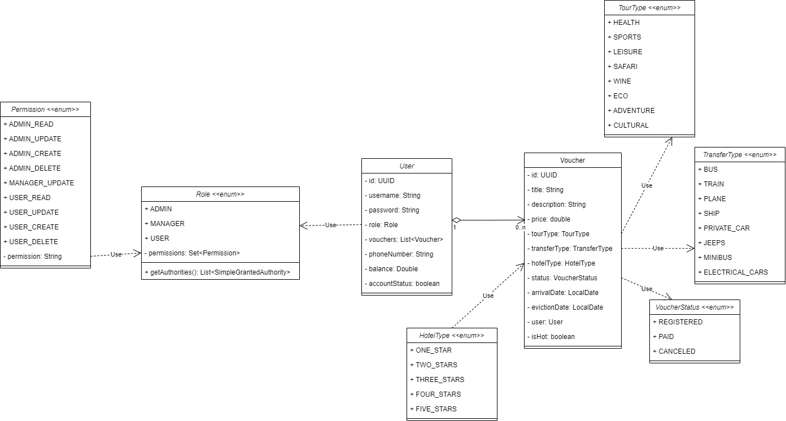

# Travel agency. Spring Project

The purpose of this task is to check your knowledge in Java and Spring.

Duration: **18** hours

## Description

In this task, you will implement "Travel Agency Service" using MVC pattern. All the main classes are available and
waiting
for you in the appropriate folders.

The class diagram of the Domain model is shown in the figure below:



The travel agency has a catalogue of tours. `Authorized user` can select tours by:

- type (rest, excursion, shopping)
- by price
- by transfer type (car, plane, ship)
- by hotel type;

> Note: only registered users can select and order tours.

`Tour` must have:

1. Title
2. Description
3. Price
4. Type of tour
5. Type of transfer
6. Hotel type
7. Status (registered, paid, canceled)
8. Arrival ate
9. Eviction date

Tour can also be hot.

`User` must have personal account, which contains information about him (name, surname, balance, email, [optional]
password), as well as a list of selected tours and their current status.

### Permissions

`Manager`

- defines tour as `hot`. These tours are always displayed at the top of the list.
- transfer the status of the tour from `registered` to `paid` or `canceled`

`Administrator` has all manager functionality, plus:

- add/delete tour
- change tour information (all fields)
- block/unblock user

## Commands

### Run project

```mvn spring-boot:run```

## Structure

Your project is organized into several packages. Here's a brief overview of each:

- All configuration classes are located here.

- **`auth`**: Contains files related to authentication.
- **`config`**: Contains configuration files for application.
- **`controller`**: Contains implementations of all declared controllers.
- **`dto`**: Contains DTO files.
- **`exeption`**: Contains custom exceptions and error handler.
- **`mapper`**: Contains Mapper files.
- **`model`**: Contains entities files.
- **`repository`**: Contains repository files.
- **`service`**: Contains service interfaces and their implementations.
- **`token`**: Contains JWT token related files.

## Requirements

You should use and successfully implement next points:

- `Spring Data JPA`
- `Spring Security`
- `Internationalization and Localization`
- `Validation`
- `Error handling`

## Nice to have

- `Logging`
- `Pagination and sorting`
- `Other Spring technologies`
- `Swagger API`
- `Thymeleaf`

## Recommendations

- Use `Lombok`
- Use tools like `Postman` or `Insomnia`
- Use `ModelMapper`

## Special message

- Not forget to improvise and try to use different approaches while implementing your solution.
- Time is limited to 18 hours. Don't waste your time.